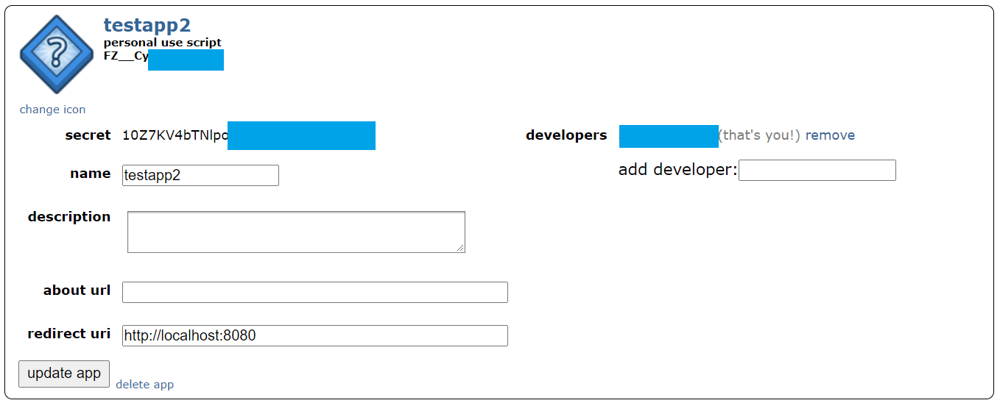

# Checkpoint 1

## Pobieranie danych

Opis pobierania danych skopiowany z brancha master znajduje się poniżej

## Tworzenie artybutów z postów tekstowych 

Cały kod dostępny jest w [notebooku.](https://kokes.github.io/nbviewer.js/viewer.html#aHR0cHM6Ly9naXRodWIuY29tL1Z1bHdzenR5bi9QRUQvYmxvYi9jaGVja3BvaW50XzEvbm90ZWJvb2tzL3RleHQvZ2VuZXJhdGVfYXR0cmlidXRlcy5pcHluYg==)

### Getting Posts
It's all already done, but if you'd like to use our scripts to get other posts here is how to do it:
1. Go to https://www.reddit.com/prefs/apps/
2. Create app: give it any name, choose script, set redirect uri to http://localhost:8080, you shoudl see something like this:

3. Clone this repo
4. Create a `.env` file in the root directory and put envs into it:
```
CLIENT_ID=<the string under "personal use app" in the screen>
CLIENT_SECRET=<secret from the screen>
USER_AGENT=<anything e.g. testscript by u/your_user_name> It doesn't really need to be an env
REDDIT_USERNAME=<username of reddit account used for the creation of app in screen>
PASSWORD=<the password for this username>
```
I should look like this:
```
CLIENT_ID=FZ__Cy<rest of id>
CLIENT_SECRET=10Z7kV4btNlpo<rest of secret>
USER_AGENT=testscript by u/deepfuckingvalue 
REDDIT_USERNAME=deepfuckingvalue
PASSWORD=hunter2
```
5. Run `get_ids.py` - now it can take a long time and should you need to pause it you should:
    1. copy the last like printed (e.g. `100 1986055`), 
    2. kill the process
    3. when you want to resume the process change the filename in `f = open("ids.txt", "w")` to e.g. `ids2` (yeah, I know I could probably append to the file) 
    4. comment or remove `end_ts = int(dt.datetime(2021, 2, 11, 12).timestamp())`,
    5. uncomment `# end_ts = start_ts + 1093144` and put the value from the copied last line in place of `1093144`
6. Once `get_ids` finishes you and you have more than one file use `merge_ids.py` to merge them into one replace `['ids1.txt','ids2.txt','ids3.txt']` with the list of your filenames
7. Use `filter.py` to filter removed posts - in my case they were more than 95% of all posts, so it was worth it. Note that this also creates a file with ids, timestamps, and flag if a post is deleted for plotting purposes, if you do nto want this comment lines with `f2` variable.
8. Use `mapper.py` to map ids of unremoved posts to their current statistics. If you need more (or less) information edit `line = [...]` `i` in this case is a [praw.models.submission](https://praw.readthedocs.io/en/latest/code_overview/models/submission.html)